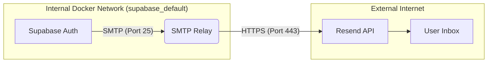

# Centralized Email Gateway (SMTP-to-API Relay)

## Overview
This service is a crucial infrastructure component designed to bypass **SMTP port blocking** commonly enforced by cloud providers like DigitalOcean (ports 25, 465, 587).

Instead of attempting (and failing) to send outbound SMTP traffic directly, authentication services (like Supabase Auth/GoTrue) send emails to this **internal relay** via standard SMTP on port 25. This relay then transforms the email and sends it out via the **Resend API** over HTTPS (port 443), which is standard open web traffic.

## Architecture



## Setup & Deployment

### 1. File Structure
The service files are located in `/srv/supabase/smtp-relay/`:
- `Dockerfile`: Node.js alpine image.
- `index.js`: The relay logic using `smtp-server` and `axios`.
- `package.json`: Dependencies.

### 2. Docker Compose Configuration
Add the service to your `docker-compose.yml`:

```yaml
services:
  smtp-relay:
    container_name: smtp-relay
    build: /srv/supabase/smtp-relay
    restart: unless-stopped
    environment:
      RESEND_API_KEY: ${RESEND_API_KEY}
    networks:
      - default # Ensure this matches supabase-auth network
```

### 3. Environment Variables
Add your Resend API key to `.env`:
```bash
RESEND_API_KEY=re_123456...
```

### 4. Configure Supabase Auth
Update `docker-compose.yml` for `supabase-auth` (or `.env`):
```bash
GOTRUE_SMTP_HOST=smtp-relay
GOTRUE_SMTP_PORT=25
GOTRUE_SMTP_USER=    # Leave empty
GOTRUE_SMTP_PASS=    # Leave empty
GOTRUE_SMTP_ADMIN_EMAIL=your-sender@domain.com
```

### 5. Start/Restart
```bash
# Rebuild relay and restart auth
docker compose up -d --build smtp-relay
docker compose up -d --no-deps auth
```

## Troubleshooting

### "Hostname resolving error" / "Connection refused"
This usually means `supabase-auth` cannot see `smtp-relay`.
1. **Check Networks**: Ensure both containers are on the same Docker network (usually `supabase_default` or check `docker network ls`).
2. **Check Project Name**: If deploying via `docker compose -p supabase up`, ensure you consistently use the `-p supabase` flag so containers are grouped correctly.

### "Gateway Timeout" (504)
If the relay is working but Resend times out:
- Check outgoing HTTPS (port 443) connectivity from the server: `curl -v https://api.resend.com`

### View Logs
```bash
docker logs -f smtp-relay
```
